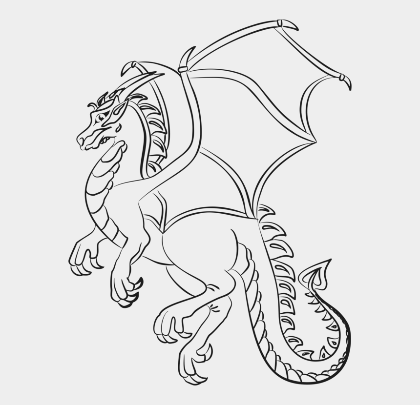
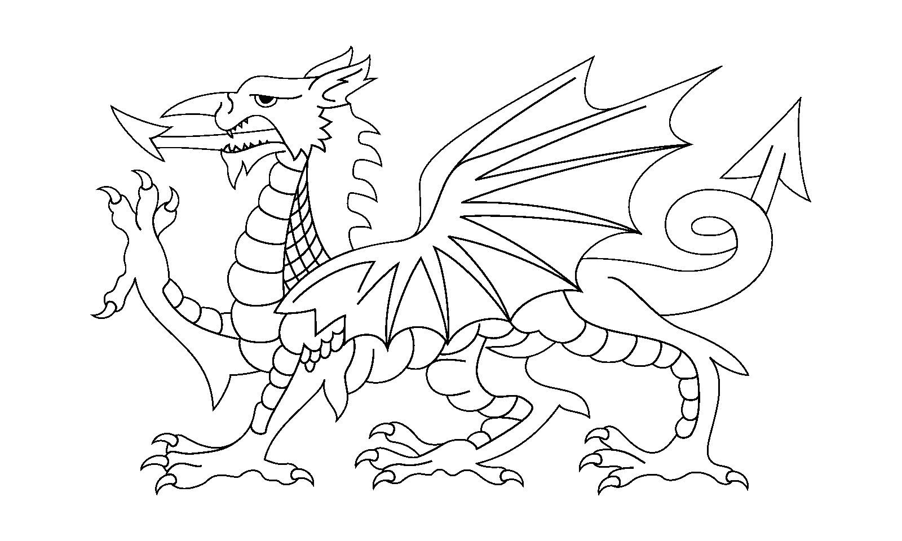
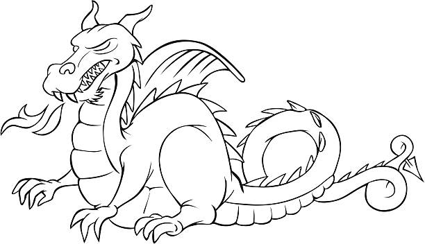

# Project Info
Github username: [LoganWisteard](https://github.com/LoganWisteard)  
[Github repository](https://github.com/LoganWisteard/Dragon-Phylogeny)


### 3. Download the Dragon Phylogeny nexus data and append your dragons to the dataset. Save this in a folder called 'input' and add one line coding characteristics for each of your 3 dragons.

```{r}
devtools::install_github("YuLab-SMU/ggtree")
devtools::install_github("GuangchuangYu/ggimage")
```
#loading files 
```{r}
library(ape)
library(reshape2)
library(ggplot2)
library(ggtree)
library(ggimage)
```

#reading the csv file for weights 
```{r}
DragonNexus <- read.nexus.data("input/DragonMatrix.nex")
```

### 4. Apply the same trait weightings as those used in the Dragon Phylogeny Tutorial.
```{r}
weightsDat <- read.csv("/Users/loganwisteard/Desktop/homefolder/Dragon Phylogeny/input/Weights.csv")
```

```{r}
weights <- paste0(weightsDat$Weight, collapse = "")
weights <- strsplit(weights, split = "")
```

```{r}
weightsNum <- rep(NA, length(weights))
for(i in 1:length(weightsNum)){
  if(weights[i] %in% LETTERS){
    weightsNum[i] <- which(LETTERS == weights[i]) + 9
  } else {
    weightsNum[i] <- weights[i]
  }
}
```

Re-calcualting our distance matrix
```{r}
wtDragonNexus <- DragonNexus
for (i in 1:length(DragonNexus)) {
  Repweight <- DragonNexus[[i]]==1
  wtDragonNexus[[i]] <- weightsNum[Repweight]
}
```

#creating a dataframe of the weighted characteristics 
#adding row names
#adding the distance to the dataframe
#converting the distance to a matrix
```{r}
wtDragonDF <- data.frame(matrix(unlist(wtDragonNexus), ncol = length(wtDragonNexus[[1]]), byrow = T))
row.names(wtDragonDF) <- names(wtDragonNexus)
```

```{r}
wtDragonDist <- dist(wtDragonDF, method = "euclidean")
wtDragonDM <- as.matrix(wtDragonDist)
```


Create the tree using neighbour joining methods
```{r}
wtDragonNJ <- nj(wtDragonDist)
```

```{r}
country <- gsub(".*\\d+([^X]*).*", "\\1", row.names(wtDragonDF))
dragon <- split(row.names(wtDragonDF), country=="dragon")
wtDragoncol <- groupOTU(wtDragonNJ, dragon)
```

### 5. Embed images showing your dragon choices in your R markdown report.


 [link:](https://https://davidrothwellgraphics.wordpress.com/2019/03/14/adding-my-own-touches//)


 [link:](https://http://clipart-library.com/dragon-drawings-black-and-white.html/)


 [link:](https://www.freeimages.com/pt/premium/dragon-outline-1522416l)
 
Create the tree using neighbour joining methods

```{r}
library(ggtree) 
WtDragonTreeNJ <- nj(WtDragonDist) 
Country<-gsub("[0-9\\.]+([^X]+)X*","\\1",WtDragonTreeNJ$tip.label) 
CountryGroups <- split(WtDragonTreeNJ$tip.label, Country) 
WtDTcol <- groupOTU(WtDragonTree, c("75Dragon1X", "76Dragon2X", "7775Dragon3X"))

```


